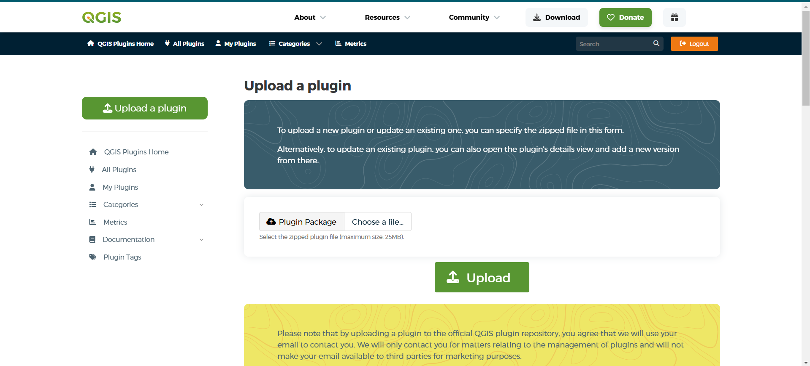
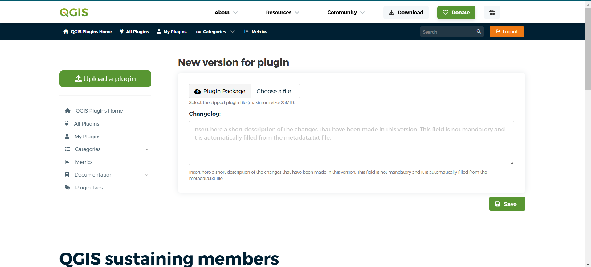

QGIS Admin
##############

Publish the MISLAND QGIS plugin
================================

This document provides a complete guide for administrators and GIS developers on how to package and publish the **MISLAND** QGIS plugin to the official QGIS Plugin Repository.

.. contents:: Table of Contents
   :depth: 2
   :local:

1. Introduction
---------------

The **MISLAND** plugin is a QGIS plugin supporting calculation fo indicators, access to data, and production of print maps. The code for the plugin, and further instructions on installing it if you want to modify the code, are in `MISLAND <https://github.com/Kevin-Kiprotich/MISLANDAFRICA>`_ Github repository.

2. Prerequisites
----------------

Before you begin, ensure you have the following:

- The MISLAND plugin installed on your machine.
- QGIS installed locally
- A registered account on the QGIS Plugin Repository: https://plugins.qgis.org

Recommended directory structure:

.. code-block:: text

      MISLAND/
   ├── data/                 # Contains all constants like the computation years
   ├── gui/                  # Contains all the graphical user interfaces
   ├── help/
   ├── i18n/
   ├── icons/                # Contains all the icons
   ├── processing_provider/
   ├── scripts/
   ├── test/
   ├── algorithms.py
   ├── api.py
   ├── calculate.py
   ├── CVI.py
   ├── downloads.py
   ├── forests.py
   ├── icon.png
   ├── LICENSE
   ├── medalus.py
   ├── metadata.txt           # QGIS plugin metadata
   ├── misland_logo.png
   ├── plugin.py              # The plugin's entry point
   ├── plugin_upload.py
   ├── resources.py
   ├── resources.qrc          # Qt resource file
   ├── SDG.py                
   ├── settings.py
   ├── Styles.py
   ├── summary.py
   └── vegetation.py

3. Cleanup Before Publishing
----------------------------

Before creating the ZIP package, you must clean up your plugin directory to avoid uploading unnecessary or sensitive files.

**Delete the following items (if they exist):**

- Any generated files left in the repository (ui_*.py, resources_rc.py, gen. help files…).
- __MACOSX, .git, __pycache__ or other hidden directories

.. admonition:: Note

   Ensure the plugin's root directory has the ``LICENSE`` file containing the relevant license governing the plugin's use and distribution.

4. Update `metadata.txt`
-------------------------

Ensure your `metadata.txt` is complete and up to date. Example:

.. code-block:: ini

   [general]
   name=misland
   qgisMinimumVersion=3.22
   description=A plugin for land parcel visualization and management
   version=1.0.0
   author=GIS Admin Team
   email=gis@example.org
   changelog=changelog.txt
   homepage=https://github.com/your-org/misland-plugin
   tracker=https://github.com/your-org/misland-plugin/issues
   repository=https://github.com/your-org/misland-plugin

Refer to the QGIS documentation for all valid fields:  
https://docs.qgis.org/latest/en/docs/pyqgis_developer_cookbook/plugins/plugins.html#plugin-metadata

.. admonition:: Note

   Always ensure you update the version of the plugin every time you want to upload a new version of the plugin

5. Create the Plugin ZIP File
-----------------------------

Zip the folder the contains the plugin's source code, that is, the plugin's root folder.

.. code-block:: text

   zip -r MISLAND.zip MISLAND

6. Register on the QGIS Plugin Repository
-----------------------------------------

If you haven't already:

1. Visit https://www.osgeo.org/community/getting-started-osgeo/osgeo_userid/
2. Complete registration and confirm your email
3. Log in and navigate to **My Plugins > Upload a plugin**

7. Upload the Plugin
--------------------

1. Go to https://plugins.qgis.org/plugins/add/
2. Upload the `misland.zip` file
3. Fill in any relevant plugin details that are requested
4. Click **Submit Plugin**

   *Plugin Upload form*

After upload, the plugin will be reviewed before it appears in the public listing.

8. Uploading a New Version
---------------------------

To update the plugin:

1. Increment the version in `metadata.txt` (e.g., `1.0.1`)
2. Update the changelog
3. Recreate the ZIP file
4. Go to your plugin page on https://plugins.qgis.org/plugins/MISLAND/
5. Click **Add version**
6. Upload the updated ZIP

   *Upload new version page*

9. Final Checklist
-------------------

✅ Plugin passes QGIS Plugin Validator  
✅ `metadata.txt` is updated and complete  
✅ Unnecessary files removed (`__pycache__`, `.git`, `.idea`, etc.)  
✅ ZIP file structure is flat (not nested)  
✅ Plugin tested in QGIS  
✅ Plugin submitted via QGIS Plugin Repository

10. Useful Links
----------------

- Plugin Repository: https://plugins.qgis.org/
- Plugin Guidelines: https://plugins.qgis.org/help/
- Plugin Builder: https://github.com/g-sherman/qgis-plugin-builder
- QGIS Plugin Validation: https://github.com/qgis/qgis-plugin-validator